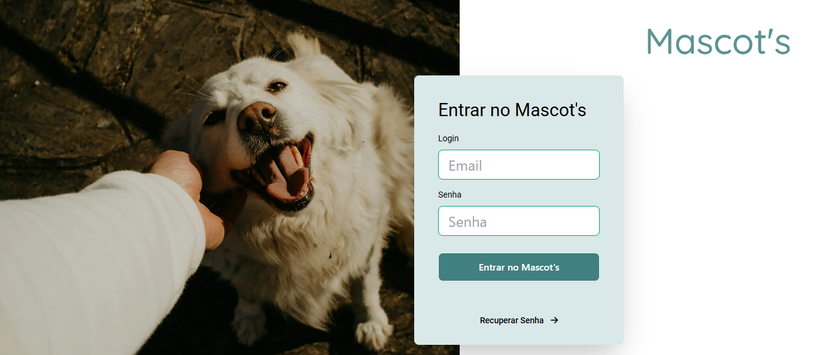
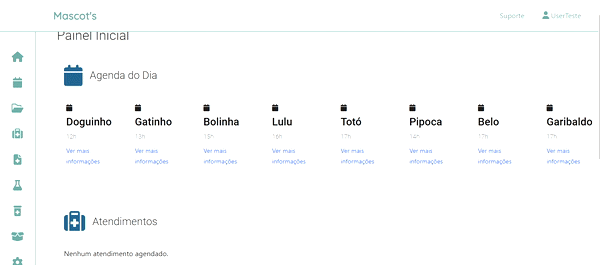
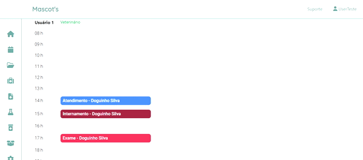
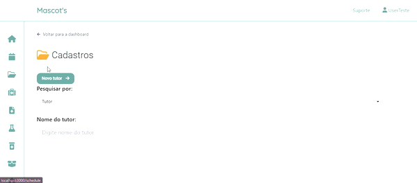
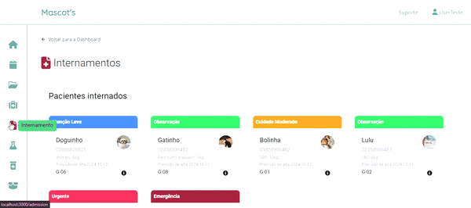

# Mascots - Clínica Veterinária 🐾

O **Projeto Mascots** foi desenvolvido como projeto final do curso de Front-End da Formação Acelerada em Programação, da Softex Pernambuco com o intuíto de facilitar a gestão da clínica veterinária, centralizando diversas funcionalidades importantes em um único sistema, de forma prática e eficiente. A aplicação foi projetada para atender as necessidades dos funcionários da clínica, como veterinários, auxiliares e administradores.


---

## 📋 Problema que o Projeto Resolve

Monta um sistema para uma melhor organização de informações sobre consultas, prescrições, internamentos, estoques e solicitações de exames, e algumas outras funcionalidades do dia a dia de uma clínica veterinária. O projeto busca resolver esses problemas ao oferecer um sistema integrado para gerenciar todas essas informações, otimizando a dinâmica de trabalho e armazenamento de dados.

---

## Telas

1. Login



2. Dashboard



3. Agenda



4. Tutor e Pet



5. Atendimento


6. Internamento



---

## 🛠️ Funcionalidades Principais

1. **Dashboard com as prinicpais informações do sistema resumidas em uma só tela**
2. **Criação de Consulta**
3. **🏥 Internamento de Animais**
4. **📦 Gerenciamento de Estoque**
5. **📁 Gerenciamento de Arquivos**
6. **Cadastro de tutores e de pets**
7. **Landing Page**

## 👥 Público-Alvo

- **Funcionários da Clínica Veterinária**:  
  Veterinários, auxiliares veterinários e administradores.

---

## 🎯 Benefícios da Solução

- **Centralização de Serviços**: Todos os serviços essenciais ficam disponíveis em um único lugar.
- **Armazenamento Seguro**: Arquivos importantes, como exames e prescrições, ficam salvos de forma organizada e acessível.
- **Otimização do Fluxo de Trabalho**: Facilita o gerenciamento de consultas, internamentos e estoque, reduzindo erros e aumentando a eficiência.

---

## 💻 Tecnologias Utilizadas

### **Frontend**

- **React** e **Next.js**: Para desenvolvimento de interfaces dinâmicas e renderização no lado do servidor (SSR).
- **Tailwind CSS** e **DaisyUI**: Para estilização rápida e criação de componentes de interface.
- **@mui/material** e **@emotion/react**: Para design e tema estilizado.

### **Formulários e Validações**

- **React Hook Form** e **Zod**: Para manipulação de formulários e validação de dados.

### **Autenticação**

- **NextAuth.js**: Para login seguro e integração com provedores de autenticação.

### **Funcionalidades Extras**

- **React Icons**: Para adição de ícones visuais.
- **jspdf**: Para geração de arquivos PDF.
- **UUID**: Para identificação única de registros.

### **Backend e Banco de Dados**

- **Firebase**: Para autenticação e armazenamento em tempo real.

### **Linguagem**

- **TypeScript**: Para maior segurança no desenvolvimento, com tipagem estática.

---

## 🚀 Como Instalar e Executar o Projeto

1. Clone o repositório:

   ```bash
   git clone https://github.com/softexrecifepe/PI-MASCOTS-TURMA-09-EQUIPE-01
   ```

2. Instale as dependências:

   ```bash
   npm i
   ```

3. Inicie o servidor de desenvolvimento:
   ```bash
   npm run dev
   ```
